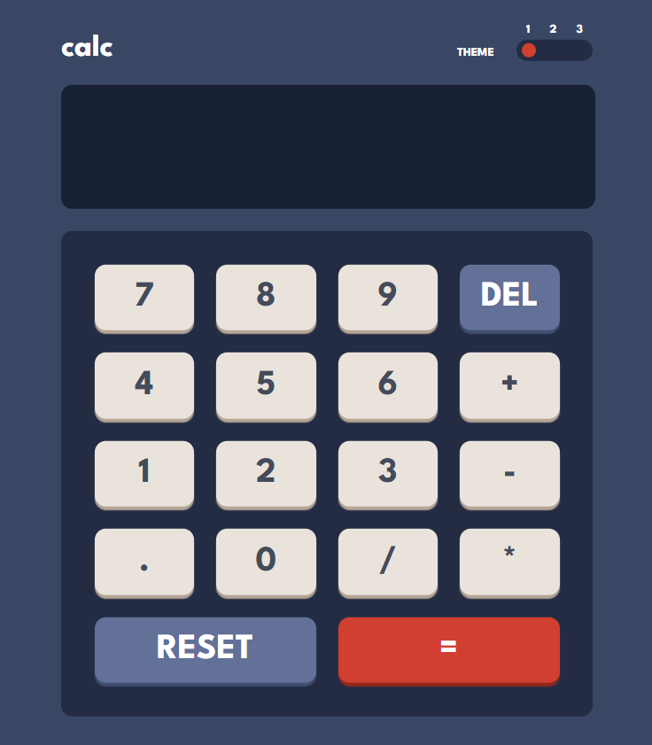
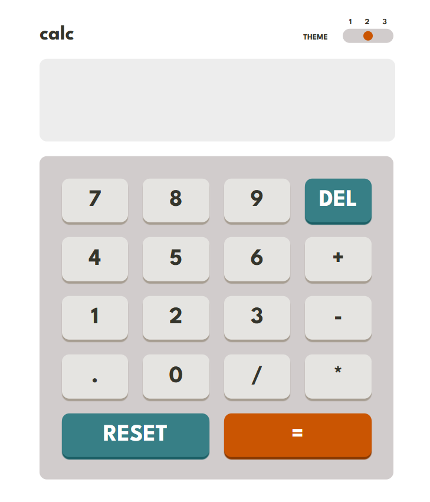
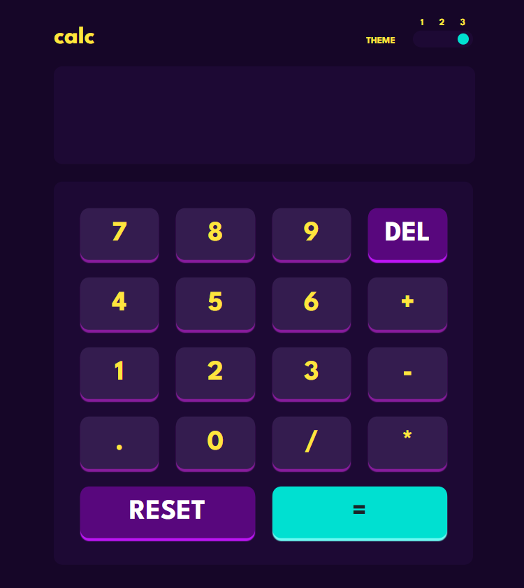

# Calculator App

A modern and stylish calculator built with HTML, CSS, and JavaScript.  
It performs basic arithmetic operations and includes 3 customizable themes for a personalized look.

**Live Site:** [Click Here](https://cryosleeperx20.github.io/Calculator-App/)
---

## Features

- Supports addition, subtraction, multiplication, and division  
- Three selectable themes to match user preference  
- Sleek, responsive, and visually engaging design  

---

## Screenshots

  
  
  

---

## Tech Stack
- HTML5 
- CSS
- JavaScript  
